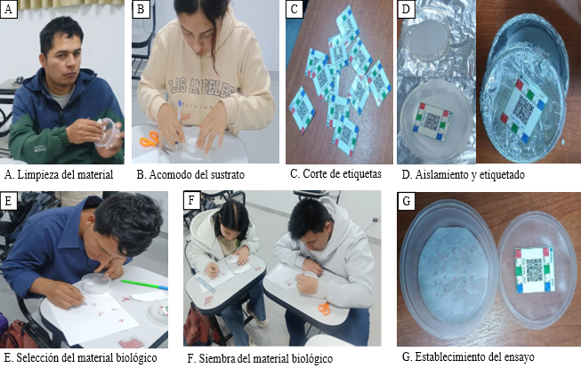

---
format:
  html:
    mainfont: Tinos
    title-block-banner: false
    toc: false
    number-sections: false
---

# Materiales y métodos

## Materiales: 

-   Papel toalla

-   Papel aluminio

-   Jeringa

-   Agua mineral

-   Pinzas

-   Cinta scotch

-   Ligas

-   Regla

-   Tijera

-   Etiquetas

-   Laptop

-   Recipientes (tapers)

-   Semillas de lechuga (*Lactuca sativa* L.)

## Metodología:

Se evaluó la germinación de semillas de lechuga (*Lactuca sativa L.),* bajo condiciones controladas (Sin luz y Con luz), utilizando un diseño completamente al azar (DCA) con 2 tratamiento y 6 repeticiones (12 unidades experimentales)

Cada unidad experimental consistió en un recipiente de plástico limpio y papel toalla humedecido con agua destilada colocado en el fondo del taper. Se colocaron 25 semillas, distribuidas de forma uniforme. Los recipientes fueron identificados con etiquetas y los recipientes sin luz se cubrieron con papel aluminio.

Las unidades experimentales se mantuvieron cerradas para conservar humedad y se hizo evaluación por cinco días. Las observaciones diarias se anotaron en el libro de campo.

**Figura 1:** *Procedimiento empleado para inicio de análisis de germinación.*
