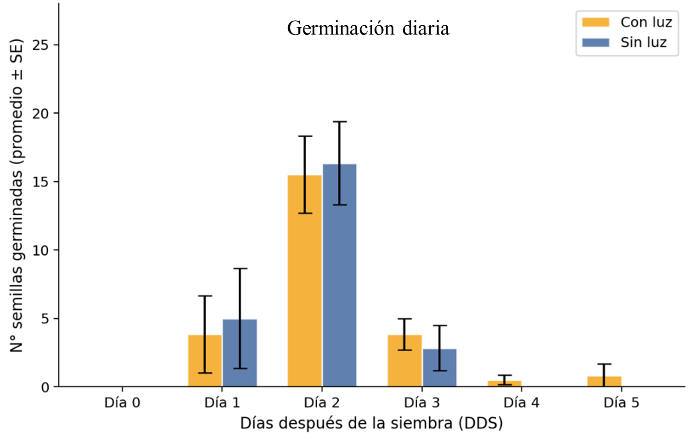
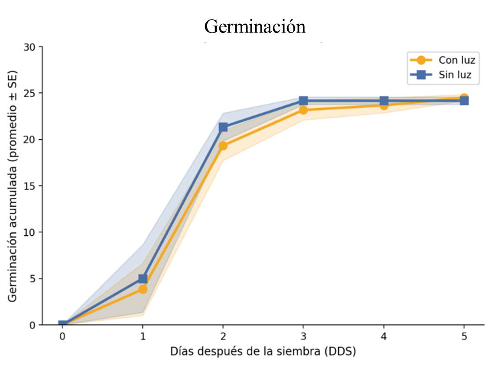
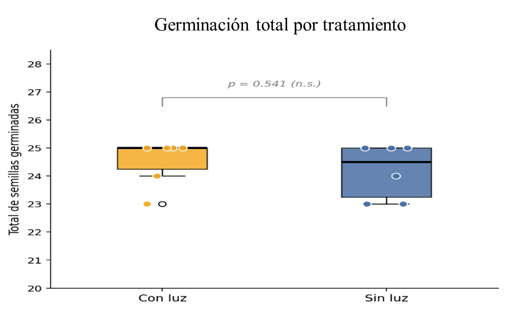
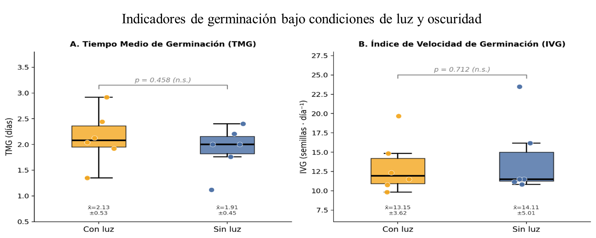

---
format:
  html:
    mainfont: Tinos
    title-block-banner: false
    toc: false
    number-sections: false
---

# Resultados y discusiones

## Resultados:

**Germinación diaria por tratamiento**

En ambos tratamientos, la germinación inició el día 1, con valores ligeramente mayores en ausencia de luz (x̄ = 5.00 ± 3.22) que con luz (x̄ = 3.83 ± 3.49). El pico de germinación ocurrió el día 2 en ambos casos (con luz: x̄ = 15.50 ± 3.45; sin luz: x̄ = 16.33 ± 3.44). A partir del día 3, la germinación disminuyó notablemente, registrándose valores mínimos o nulos en los días siguientes, salvo una réplica con luz que se extendió hasta el día 5 (Figura 2).

{fig-align="center" width="383"}

**Figura 2:** *Germinación diaria.*

**Germinación acumulada**

La germinación acumulada presentó un patrón sigmoide en ambos tratamientos: germinación masiva (días 1–3) y estabilización desde el día 4. Al día 5, se alcanzaron valores similares: 24.50 semillas con luz y 24.17 sin luz, de un total de 25 semillas por unidad experimental (Figura 3).

{fig-align="center" width="349"}

**Figura 3:** *Germinación acumulada.*

**Germinación total de semillas y análisis estadístico**

El total de semillas germinadas fue similar entre tratamientos (con luz: 24.50 ± 0.84; sin luz: 24.17 ± 0.98). La prueba t de Student no mostró diferencias significativas (t = 0.632; p = 0.541), indicando que la luz no afectó la germinación bajo las condiciones del experimento (Figura 4).

{fig-align="center" width="369"}

**Figura 4:** *Germinación total por tratamiento.*

**Tiempo medio de germinación (TMG) e Índice de velocidad de germinación (IVG)**

El TMG fue de 2.13 ± 0.48 días con luz y 1.92 ± 0.41 sin luz, mostrando una leve tendencia a germinar más rápido en oscuridad, aunque sin diferencias significativas. El IVG también fue ligeramente mayor en ausencia de luz (14.10 ± 4.57) que con luz (13.15 ± 3.30) (Figura 5).

{fig-align="center"}

**Figura 5:** *Indicadores de germinación bajo condiciones de luz y oscuridad.*

## Discusiones:

**Efecto de la luz en la germinación de lechuga**

La germinación de *Lactuca sativa* está regulada por factores internos y externos, siendo la luz un factor clave mediado por el fitocromo (Bewley et al., 2013; Quail, 2002). Aunque clásicamente se espera menor germinación en oscuridad (Borthwick et al., 1952), en este estudio no se encontraron diferencias significativas entre tratamientos (t = 0.632; p = 0.541).

El porcentaje final de germinación fue muy similar (con luz: 24.50 ± 0.84; sin luz: 24.17 ± 0.98), así como la velocidad germinativa, con un TMG de 2.13 ± 0.48 días (luz) y 1.92 ± 0.41 días (oscuridad), y un IVG ligeramente mayor en ausencia de luz (14.10 ± 4.57 vs 13.15 ± 3.30).

Estos resultados sugieren que, bajo condiciones óptimas, semillas con alto vigor pueden mostrar baja sensibilidad a la luz, posiblemente por la persistencia de fitocromo activo incluso en ausencia de iluminación (Finch‐Savage & Leubner‐Metzger, 2006; Yanniccari et al., 2012).

**Inicio y pico de germinación**

La germinación inició el día 1 y alcanzó su pico el día 2 en ambos tratamientos, lo que coincide con el comportamiento típico de *Lactuca sativa*, cuya germinación ocurre en 24–72 h bajo condiciones óptimas (Nascimento & Cantliffe, 2002). La curva acumulada mostró un patrón sigmoide característico, asociado a la variabilidad en el tiempo de germinación y descrito por modelos de umbral hídrico (Bradford, 2002).

El tratamiento sin luz presentó un inicio ligeramente más precoz (días 1–2), posiblemente por efectos del fitocromo en forma Pr (Batlla & Benech-Arnold, 2010); sin embargo, esta diferencia no fue estadísticamente significativa y debe interpretarse con cautela (n = 6).

**Implicancias prácticas**

Los resultados indican que, en las condiciones del experimento, la ausencia de luz no afecta la capacidad germinativa de la lechuga. Esto tiene importancia práctica, ya que respalda su siembra en bandejas cubiertas durante los primeros días, como es común en almácigos (Hernández-Herrera et al., 2014).
